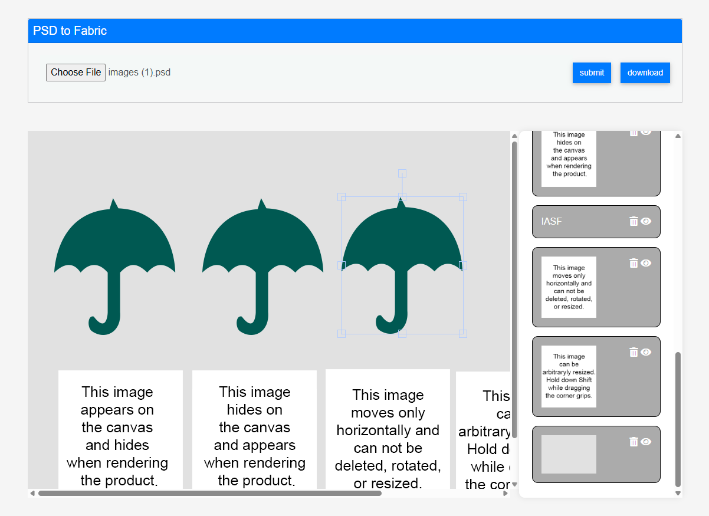

# 🖼️ PSD to Fabric.js Canvas Tool

A web-based tool that converts PSD files into editable Fabric.js canvas elements. Easily visualize, manipulate, and export layered PSD designs directly in the browser.

## 🚀 Features

- 🎨 **Render PSD to Fabric.js Canvas**
- 📁 **Layer System** – Supports individual layer manipulation.
- ❌ **Delete Item** – Remove any layer from the canvas.
- 👁️ **Eye Button** – Toggle layer visibility (hide/unhide).
- 💾 **Download Canvas** – Export the final canvas as **JPG** or **PNG**.
- 📏 **Canvas Auto-Sizing** – Automatically sets the Fabric.js canvas dimensions based on PSD size.

## 🛠️ Tech Stack

- **Node.js** – PSD file parsing (`psd` npm package)
- **PHP** – Executes the Node.js script from backend
- **HTML/CSS/JS** – Frontend structure and styling
- **Fabric.js** – Renders and manipulates canvas
- **JavaScript** – Layer controls, Render and export logic

## 📸 Screenshot



## 📦 Installation

1. Clone the repo:
```bash
git clone https://github.com/alihamza-developer/psd-to-fabricjs.git
cd psd-to-fabricjs
```

2. Install dependencies:
```bash
npm install
/temp 
/extensions/temp
```

3. Set up your PHP server and ensure it can execute the Node.js script.

4. Upload your `.psd` file via the frontend and watch it render onto the canvas!

## 📄 License

MIT – Use this project freely in your personal or commercial projects.